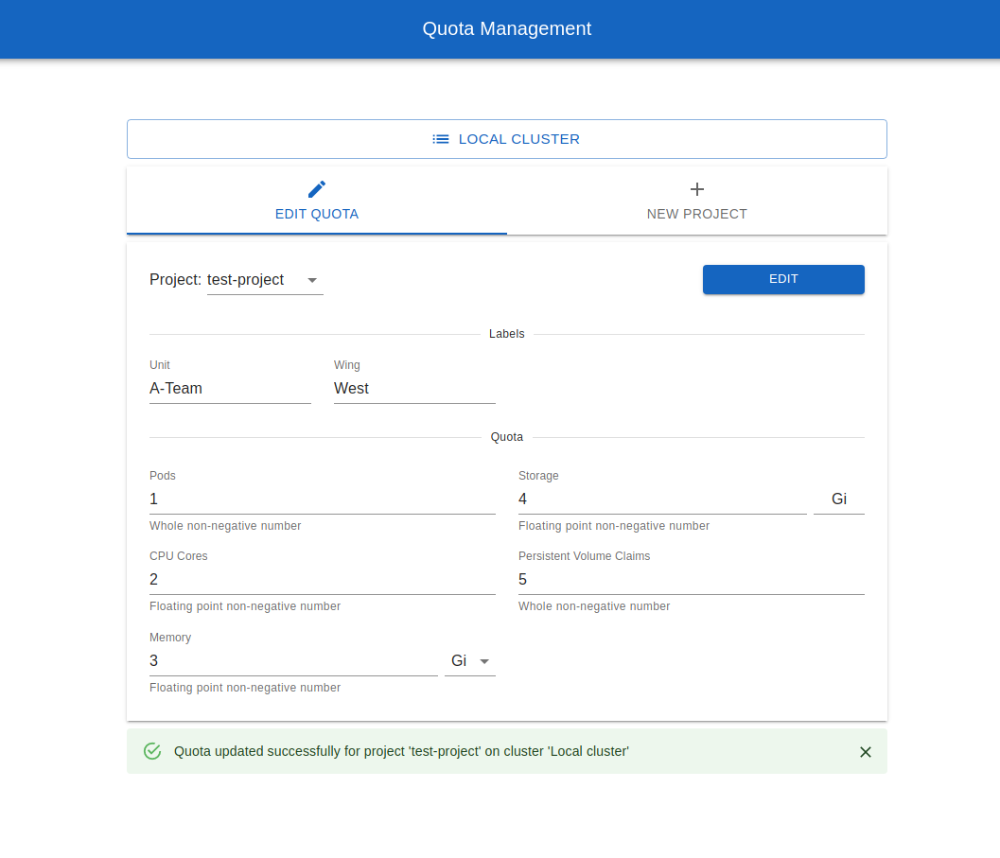

# Quota Management

OpenShift application for easy management of resources for projects located within multiple clusters.

<p align="center">
  
</p>

## In short

- This is a single go-to interface for creating projects and managing quota for these projects across multiple clusters
- ResourceQuota fields meant for editing are fully configurable and the application supports multiple ResourceQuota objects
- Full schema validation on client and server
- Clear distinction between development and production clusters
- Quota managers do not carry the RBAC permissions, the application itself performs the actions
- Each request is logged accordingly and can be persisted
- Optional namespace labeling

## Deployment

1.  (Disconnected environment) Run `make disconnected-files` and transfer all the files in "./disconnected" directory to your environment
2.  Run `oc new-project <project-name>` to create a new project for the application. Make sure the project has enough quota:
    - 4 pods (2 for currently running instances, 2 for rolling updates)
    - 200m CPU (100m for currently running instances, 100m for rolling updates)
    - 512Mi Memory (256Mi for currently running instances, 256Mi for rolling updates)
3.  (Disconnected environment) Push the transfered image to the internal repository of the project / other reachable registry
4.  Process the application template like so:

    ``` bash
    oc process -o yaml -f deploy/quota-management-template.yaml \
        -p IMAGE=<quota-management-image (only relevant for disconnected environments)> \
        -p ROUTE=<quota-management-custom-route-hostname (optional)> \
        > quota-management.yaml
    ```

    Note: more parameters are available and can be viewed at the bottom of the template file

Before creating the application manifest, configure its behavior to match your environment using the Management step below.

## Management

Edit the resulting manifest using `vim quota-management.yaml` command. Objects of interest:

- Group: users in this group are allowed to access the application, edit quota and create new projects. Add relevant users to the list (as they appear in the output of `oc get users`)
- ConfigMap (quota-scheme): this scheme tells the application which ResourceQuota objects and which fields within them can be edited. It also allows for optional namespace labeling.
  Here is how this dictionary works:

  - __labels__: dictionary of string:string key-value pairs where the key is the label key and value is display name for that label in UI. Leave the dictionary empty to disable the feature.
  - __quota__: dictionary of string:object key-value pairs which work as described below:
    - 1st level keys: ResourceQuota objects by that name that exist in the namespace
      - 2nd level keys: fields that are present in `.spec.hard` of their ResourceQuota object
          - __name__: display name for the current field
          - __units__: allowed units (Mi, Gi, etc.) for the current field. Can be blank (pods, pvcs), quota unit (Memory, Storage, CPU), or a list of quota units to choose from
          - __type__: data type for the current field (can only be "int" or "float")

  Quota Management assumes that `quota` objects and fields within them are defined in the default project request template of each managed cluster.

- ConfigMap (ca-bundle): CA certificates that this application trusts
- Secret: clusters that Quota Management can manage. Each key in the secret represents a cluster and value for each key must be a dictionary with the following fields:

  - __displayName__: display name for the cluster
  - __api__: full API URL for the remote cluster ("https://api-host:port")
  - __production__: boolean which tells the application whether the cluster is production
  - __token__: bearer token used to perform management on remote cluster

  In order to get the token, a service account with proper permissions must be created on that cluster. Run `oc create -f deploy/quota-management-serviceaccount.yaml` against the remote cluster to create it. Then retrieve the token using `oc sa get-token quota-manager -n default`.

- ServiceAccount: service account for application pods to run with. It carries permissions (specified below) and also serves as an [authentication client](https://docs.openshift.com/container-platform/4.6/authentication/using-service-accounts-as-oauth-client.html)
- ClusterRole: permissions to perform token reviews (to resolve the user name for the user accessing the application) and get a list of quota managers from the group.
- ClusterRoleBinding: grants permissions above to the application service account
- Deployment/Service/Route: the application itself. Generally should not be of interest

Now deploy the manifest: `oc create -f quota-management.yaml`

### Persistent logging

Quota Management can persist audit, debug and warning logs to a persistent volume. Here is how you can configure it:
- Create an RWX PVC in the application namespace
- Mount in to the pod by editing the deployment object
- Set value for the `LOG_STORAGE` environment variable within the deployment object to the mount path

Logs can be read by issuing the following command: `oc exec svc/quota-management -n quota-management -- logs`

## Development

Quota Management is developed using Git Feature Branch workflow - each feature should be developed in a separate branch and then integrated into the "main" branch by means of a pull request. Each release is a tag and each tag represents a point in time in a "main" branch when enough features and fixes have been accumulated to represent a new version. Usually a release is created after some major addition (like project creation in [1.2](https://github.com/paas-team-324/quota-management/releases/tag/1.2) and management over multiple clusters in [1.3](https://github.com/paas-team-324/quota-management/releases/tag/1.3)). Tags are formatted using semantic versioning (sort of, only major and minor versions are specified).

### Adding a feature / fix

1. Create a new branch for the feature:

   ``` bash
   git checkout -b feat/my-feature
   ```

2. Implement feature
3. Set-up environment for testing (the following commands assume that CRC is running):

   ```bash
   # create testing project
   oc new-project quota-management
   oc adm policy add-role-to-user admin developer -n quota-management

   # configure project request to create ResourceQuota objects
   oc create -f deploy/examples/template.yaml
   oc patch project.config.openshift.io cluster --type='merge' --patch='{"spec":{"projectRequestTemplate":{"name":"project-request"}}}'
   ```

4. Push image with new feature to internal registry (the following commands assume that docker and CRC are running):

   ``` bash
   # trust CRC registry by following the instructions of the command below
   make get-registry-certificate

   # log-in to registry
   oc registry login --skip-check

   # build and push the image
   make build-push VERSION=my-feature
   ```

5. Deploy application. Here is how to do it quickly for testing purposes:

   ``` bash
   # process template and deploy
   oc process -o yaml -f deploy/quota-management-template.yaml -p PULL_POLICY=Always -p IMAGE=image-registry.openshift-image-registry.svc:5000/quota-management/quota-management:my-feature | oc create -f -

   # let developer manage quota
   oc patch group quota-managers --type='merge' --patch='{"users":["developer"]}'
   ```

6. Test the feature.
7. Once the feature is complete, push and create a pull request to `main`.

### Releasing a new version

1. Make sure you are on the updated `main` branch:

   ``` bash
   git checkout main
   git pull
   ```

2. Bump the version of the app to the new version in `Makefile` (at the very top) and `deploy/quota-management-template.yaml` (in the IMAGE parameter at the very bottom). Commit and push.

3. Push the release image:

   ``` bash
   docker login docker.io -u paasteam324
   make build-push IMAGE=docker.io/paasteam324/quota-management
   ```

4. Create a new tag from the last commit and from it, a new release. Specify features and fixes since the last release.
